# Olá, eu sou o Felipe 👋

Sou desenvolvedor back-end e trabalho com Java, Node.js e Python para construir APIs e resolver problemas de software.

[LinkedIn](https://www.linkedin.com/in/felipe-bueno-4a19a6285/) | [Email](mailto:felipebueno2004@protonmail.com)

---

### Stack

  
  
  
  
  
  
  
  
  

---

### Estatísticas

  
  

